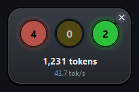

<p align="center">
  
</p>

<h1 align="center">ChafficLight</h1>

## What it does

ChafficLight watches your **Claude Code CLI** and **Codex CLI** chat sessions and shows
their status as one small traffic light floating on your desktop. The number inside each
lamp is how many sessions are in that state:

| Lamp | Meaning |
|---|---|
| 🔴 red | done — the turn is over, waiting for your next prompt |
| 🟡 yellow ✨ | needs input — the agent asked you something and is blocked. **This lamp flashes.** |
| 🟢 green | running — the agent is working and wants nothing from you |

Underneath the lamps are the tokens spent since the app started, and the current tokens/sec.

<p align="center">
  
</p>

It only ever reads the two CLIs' state directories — it never writes to them.

## Install

Download the [latest release](https://github.com/HangYu8123/ChafficLight/releases/latest)
for your platform, unpack it, and run `ChafficLight`. No Python needed.

| Platform | Archive |
|---|---|
| Windows | `ChafficLight-<version>-windows.zip` |
| macOS | `ChafficLight-<version>-macos.tar.gz` |
| Linux | `ChafficLight-<version>-linux.tar.gz` |

The builds are unsigned, so the first launch needs one extra click: on Windows,
*More info* → *Run anyway*; on macOS, *System Settings* → *Privacy & Security* → *Open Anyway*.

Or install from source with Python 3.12+ (needs `tkinter`):

```bash
pipx install git+https://github.com/HangYu8123/ChafficLight.git
```

## A bit more

**Start it at login:**

```bash
chafficlight --enable-autostart     # --disable-autostart undoes it
```

This registers the app with your own desktop's login mechanism — a Startup shortcut on
Windows, a LaunchAgent on macOS, an autostart `.desktop` file on Linux. It records where
the app is *now*, so re-run it if you move the app. `--install-desktop` separately adds a
click-to-run icon to your Start Menu / Applications.

**The code:** `cli_traffic_light/` — `claude.py` and `codex.py` read each CLI's session
files, `monitor.py` merges them into one list, `tokens.py` counts tokens, `gui.py` draws
the window, `cli.py` is the entry point. `chafficlight --once` (or `--once --json`) prints
one snapshot with per-session detail instead of opening the window. Tests live in `tests/`:

```bash
python -m pytest tests/ -q
```
